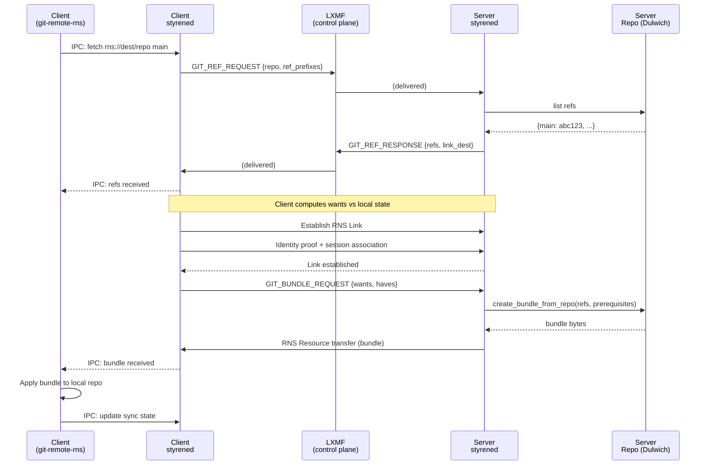

# git-over-styrene: Version Control Over Mesh Networks

**Date**: 2026-02-23
**Status**: Research / Architecture / Feasibility Analysis
**Scope**: Transport design, prior art, trade-off analysis, packaging strategy

## 1. Abstract

git-over-styrene is a proposed system for performing git operations (fetch, push, clone) over [Reticulum](https://reticulum.network/) mesh networks using styrened as the service daemon. The approach uses git bundles as the transport primitive -- eliminating the multi-round negotiation of git's native pack protocol -- with LXMF as the control plane and RNS Links as the data plane, mirroring the architecture proven by styrened's terminal session implementation. This document concludes that the system is **feasible at medium difficulty**, with a read-only MVP achievable as a new styrened service module backed by [Dulwich](https://github.com/jelmer/dulwich) for pure-Python git operations.

## 2. Problem Statement

### Why version control over mesh networks?

Reticulum enables communication across intermittent, high-latency, and bandwidth-constrained links -- LoRa radios, packet radio, serial links, TCP tunnels, and combinations thereof. Devices on these networks need software updates, configuration changes, and code deployment, but have no reliable path to conventional git hosting (GitHub, GitLab, etc.).

Today, getting code onto a mesh-connected device means either physical access (sneakernet), tunneling through `rnsh` (fragile, bandwidth-wasteful), or manual file transfer via `rncp` (no version tracking). None of these integrate with standard developer workflows.

### Use cases

- **Fleet configuration management**: Push config changes to edge devices (Pi 4B, Zero 2W) across the styrene mesh without physical access.
- **Edge code deployment**: Deploy application updates to remote nodes via `git pull` rather than manual file transfer.
- **Offline-first development**: Developers working in disconnected environments sync repositories when connectivity is available, with full history and branching.
- **Repo mirroring across air-gapped networks**: Mirror public repositories into isolated mesh networks for reference or deployment.
- **Disaster recovery**: Distribute repository replicas across geographically dispersed mesh nodes.

### What "git pull on a public repo" means here

A user on a mesh-connected device runs `git pull mesh main` and receives the latest commits from a styrened node hosting a bare repository. The transfer happens over whatever Reticulum transport is available -- a LoRa link at 2 kbps, a TCP tunnel at megabit speeds, or a multi-hop path through propagation nodes. The git workflow is standard; only the transport is different.

## 3. Prior Art

### 3.1 gitsync-nncp

**Repository**: [jgoerzen/gitsync-nncp](https://salsa.debian.org/jgoerzen/gitsync-nncp) (originally on GitHub)

The closest existing analog to git-over-styrene. Syncs git repositories asynchronously over [NNCP](https://nncpgo.org/) (Node-to-Node Copy Protocol), a store-and-forward delay-tolerant network.

**Architecture**:
- No master branch -- every machine works on its own uniquely-named branch (typically hostname).
- Tracking branches prefixed `gitsync-nncp/` record last-known state of each remote peer.
- Git bundles are the transport unit -- incremental bundles containing only commits since last sync.
- Transport-agnostic: bundles piped to stdout, consumed by NNCP or any other carrier.

**Workflow**:
1. Work locally, commit to your branch.
2. `gitsync-nncp push` -- diffs local branch against tracking branch, creates incremental bundle, pipes to `nncp-exec`.
3. NNCP delivers the bundle (store-and-forward, minutes to days).
4. `gitsync-nncp receive` -- accepts bundle via stdin, updates sender's tracking branch.
5. `gitsync-nncp merge` -- merges all tracking branches into local branch.
6. Conflicts resolved manually via standard git workflow.

**Key design decisions relevant to RNS**:
- Out-of-order delivery handled gracefully -- if a bundle arrives before its prerequisite, receive fails and NNCP retries later.
- Each bundle is self-describing via git's prerequisite mechanism.
- No real-time coordination required.

**Also notable**: [git-ibundle](https://github.com/drmikehenry/git-ibundle), a tool for incremental offline mirroring with sequence-numbered bundles. Assigns monotonically increasing sequence numbers to sync points and can recover from lost bundles by selecting alternative basis points.

### 3.2 Radicle

**Website**: [radicle.xyz](https://radicle.xyz/)

The most mature decentralized git collaboration platform. Uses Git protocol v2 for data replication between peers, with a gossip protocol for peer and repository discovery. Local-first (works offline, syncs when connected). Self-certifying repositories with cryptographic signatures. Issues and patches implemented as Collaborative Objects (COBs).

**What it proves**: Git replication can work over gossip protocols with eventual consistency. However, Radicle assumes peers can establish direct TCP connections for the pack protocol -- an assumption that breaks on Reticulum's store-and-forward links.

### 3.3 git-ssb

**Repository**: [clehner/git-ssb](https://github.com/clehner/git-ssb)

Decentralized git on Secure Scuttlebutt. Commits, branches, issues, and PRs encoded as append-only log entries. Gossip protocol propagates changes to all involved peers. Works offline -- SSB Drive merges automatically when reconnecting. Peers sync over WiFi, internet, or sneakernet.

**What it proves**: Append-only logs can carry git state. However, SSB's gossip model replicates entire feeds rather than computing minimal deltas, making it bandwidth-inefficient for constrained links.

### 3.4 rnsh and rncp

Existing Reticulum tools that *could* carry git today:

- **[rnsh](https://github.com/acehoss/rnsh)**: SSH-like remote shell over RNS. Could run `git push`/`pull` through an interactive session, but this tunnels git's pack protocol over the shell -- multi-round negotiation over high-latency links, fragile session state, bandwidth-wasteful.
- **rncp**: RNS built-in file copy. Could manually transfer git bundles (`git bundle create` on one side, `rncp` to transfer, `git bundle unbundle` on the other), but there is no automation, no ref tracking, and no integration with `git remote`.

Neither approach integrates with standard git workflows or handles the lifecycle (ref negotiation, incremental sync, error recovery) that a proper transport requires.

### 3.5 Jujutsu

[Jujutsu](https://github.com/jj-vcs/jj) (`jj`) is a Git-compatible VCS written in Rust with innovations in local workflow: working-copy-as-commit, immutable changes with stable Change IDs, an operation log with full undo, and first-class conflicts recorded in commits.

**Why it is irrelevant to the transport problem**: Jujutsu has no native wire protocol. All network operations delegate entirely to Git's smart transport via the `gix` Rust library or by shelling out to the `git` binary. The networking layer is not pluggable -- there is no `Transport` trait or extension point. A maintainer stated: *"jj only abstracts out the storage of objects, it does not define or abstract out any protocols at all for network comms or synchronization"* ([discussion #8863](https://github.com/jj-vcs/jj/discussions/8863)).

**Potential complementary use**: jj's operation log and first-class conflicts would be valuable when merging bundles from multiple mesh peers with unpredictable delivery ordering. It could run on top of `git-remote-rns` since it delegates to git for network operations. The concerns are orthogonal.

### 3.6 Other systems

| System | Approach | Relevance |
|--------|----------|-----------|
| [git-annex](https://git-annex.branchable.com/) | Large file management with sneakernet sync via removable drives | Proves USB/offline sync works at scale (Baobaxia project, Densho 10+ TB) |
| [Mango](https://github.com/axic/mango) | Git objects on IPFS, Ethereum for access control | PoC only, not maintained |
| [NNCP](https://nncpgo.org/) | Secure store-and-forward file/mail/command exchange | gitsync-nncp's transport layer; friend-to-friend, statically routed |

**What does not exist**: No project implements git operations natively over Reticulum or LXMF. The RNS ecosystem currently focuses on messaging (Sideband, MeshChat), file transfer (rncp), remote shell (rnsh), and network infrastructure.

## 4. Transport Fundamentals

### 4.1 Git's native protocol

Git's [pack protocol v2](https://git-scm.com/docs/gitprotocol-v2) uses PKT-LINE framing over a bidirectional channel (TCP, SSH, HTTP). The core operations are:

1. **`ls-refs`**: Client requests ref listing with optional prefix filtering. Server responds with SHA1 + refname pairs.
2. **`fetch`**: Multi-round negotiation -- client sends `want` SHA1s (refs it needs) and `have` SHA1s (what it already has). Server responds with `ACK` for common ancestors. When enough common ground is found, server sends `ready` and then a packfile containing only missing objects.

The negotiation algorithm sends haves in batches of 32 with ACK/NAK responses per round. On a link with 500ms RTT (typical for multi-hop Reticulum), a fetch requiring 3-4 negotiation rounds adds 3-4 seconds of pure latency overhead. On store-and-forward links (minutes to hours of delay), this negotiation is completely impractical.

**Conclusion**: Git's native pack protocol is incompatible with high-latency store-and-forward networks.

### 4.2 Git bundles

A [git bundle](https://git-scm.com/docs/gitformat-bundle) is a self-contained transfer unit: a text header (prerequisites + references) followed by raw packfile data.

**Version 2 format**:
```
# v2 git bundle\n
-<prerequisite-sha1> <comment>\n     (zero or more)
<sha1> <refname>\n                    (one or more)
\n                                     (blank line separator)
PACK....                               (raw packfile bytes)
```

**Key properties**:
- **Full bundles**: `git bundle create full.bundle --all` -- everything needed to clone from scratch.
- **Incremental bundles**: `git bundle create update.bundle main ^<last-synced-sha1>` -- only objects since last sync. The excluded SHA1 becomes a prerequisite.
- **Prerequisites**: SHA1s the consumer MUST already have. `git bundle verify` checks this before applying.
- **Thin packs**: Incremental bundles use `git pack-objects --thin`, producing deltas that reference objects the consumer already has. Resolved during unbundling via `git index-pack --fix-thin`.
- **Standard consumption**: `git fetch update.bundle main:refs/remotes/mesh/main` -- works with normal git commands.

**Why bundles eliminate the negotiation problem**: The entire want/have negotiation exists to compute the minimal object set. A bundle pre-computes this: the creator knows what the consumer has (prerequisites) and what it needs (references). The bundle IS the minimal packfile. One transfer, one direction, no round-trips.

**Size characteristics**:
- A few text-only commits: **1-10 KB** incremental bundle
- A modest project full clone: **100 KB - 5 MB**
- Bundles use zlib-compressed pack data

**Limitations**: Cannot represent shallow clone boundaries. Do not include working tree, index, stash, config, or hooks.

### 4.3 Git remote helpers

A [git remote helper](https://git-scm.com/docs/gitremote-helpers) is an executable named `git-remote-<scheme>` that git invokes when interacting with a remote using the corresponding URL scheme. For git-over-styrene, `git-remote-rns` would enable URLs like `rns://<destination-hash>/repo-name`.

The **import/export** capability path is the right choice for bundle-based transport:

```
Git  -> helper:  capabilities
helper -> Git:   import
                 export
                 refspec refs/heads/*:refs/rns/<remote>/*
                 *import-marks .git/rns/<remote>/marks-import
                 *export-marks .git/rns/<remote>/marks-export
                 (blank line)
```

- **import**: Helper receives ref names from git, produces a [fast-import](https://git-scm.com/docs/git-fast-import) stream on stdout. Used for fetch/pull.
- **export**: Helper receives a fast-import stream on stdin from git. Used for push.
- **marks files**: Track correspondence between fast-import marks and git SHA1s across invocations, enabling incremental sync.

**Surveyed implementations**:
| Helper | Language | LOC | Strategy |
|--------|----------|-----|----------|
| [git-remote-dropbox](https://github.com/anishathalye/git-remote-dropbox) | Python | ~800 | push/fetch capabilities, cloud storage |
| [git-remote-rclone](https://github.com/datalad/git-remote-rclone) | Python | ~300 | Archives entire bare repo |
| git-remote-go | Go | ~250 | import/export capabilities |

**Estimated size for `git-remote-rns`**: 400-700 lines of Python for production quality, implementing import/export with Dulwich for bundle creation/parsing and styrened IPC for RNS transport.

### 4.4 Dulwich

[Dulwich](https://github.com/jelmer/dulwich) is a pure-Python git implementation (current version: 0.25.0) with optional Rust bindings. Full wire-format and repository-format compatibility with C git. No dependency on the git CLI.

**Key modules for git-over-RNS**:

| Module | Purpose |
|--------|---------|
| `dulwich.repo.Repo` | Repository access (open, create, refs, object store) |
| `dulwich.bundle` | `read_bundle()`, `write_bundle()`, `create_bundle_from_repo()` |
| `dulwich.pack` | `write_pack_data()`, `PackData`, `deltify_pack_objects()` |
| `dulwich.object_store` | `generate_pack_data(have, want)`, `MissingObjectFinder` |
| `dulwich.porcelain` | High-level: `clone()`, `fetch()`, `push()`, `bundle_create()` |

**Bundle workflow in pure Python**:

```python
from dulwich.repo import Repo
from dulwich.bundle import create_bundle_from_repo, write_bundle, read_bundle
import io

# Sender: create incremental bundle
repo = Repo("/path/to/repo")
bundle = create_bundle_from_repo(
    repo,
    refs=[b"refs/heads/main"],
    prerequisites=[last_synced_sha1],  # bytes, 40-char hex
)
buf = io.BytesIO()
write_bundle(buf, bundle)
bundle_bytes = buf.getvalue()  # send this over RNS

# Receiver: apply bundle
buf = io.BytesIO(bundle_bytes)
bundle = read_bundle(buf)
receiver_repo = Repo("/path/to/receiver/repo")
bundle.store_objects(receiver_repo.object_store)
for ref, sha in bundle.references.items():
    receiver_repo.refs[ref] = sha
```

**Why Dulwich**:
- Pure Python -- integrates natively with styrened's Python codebase.
- No git CLI dependency -- works on edge devices that may not have full git installed.
- `create_bundle_from_repo()` internally uses `MissingObjectFinder` to walk the object graph and produce only the delta between `have` and `want` sets.
- Same ecosystem (Python 3.11+) as styrened, RNS, and LXMF.

## 5. Reticulum Transport Constraints

### 5.1 LXMF message limits

LXMF has a fixed overhead of ~112 bytes per message (destination hash, source hash, Ed25519 signature, timestamp, msgpack framing).

| Delivery Method | Max Content | Mechanism |
|----------------|-------------|-----------|
| Opportunistic (encrypted) | ~295 B | Single RNS packet, no link |
| Link-based single packet | ~319 B | Over established RNS Link |
| Link-based resource | Effectively unlimited | RNS Resource transfer |
| Propagated (via prop node) | 256 KB default | Configurable per-transfer limit |
| Propagated sync batch | 10,240 KB default | Configurable per-sync limit |

The critical threshold is **319 bytes**: messages at or below this travel as single packets. Larger messages automatically switch to RNS Resource transfer. LXMF chooses between single-packet (opportunistic) and link+resource (direct) based on size.

### 5.2 RNS Link + Resource

RNS Links provide reliable, bidirectional, encrypted channels with forward secrecy (ECDH on Curve25519).

- **Establishment cost**: 3 packets, 297 bytes.
- **Keepalive overhead**: 0.45 bps (negligible).
- **Concurrency**: 100 links on a 1200 bps channel leaves 96% capacity for data.

[RNS Resources](https://reticulum.network/manual/) handle arbitrary-sized transfers:

```python
RNS.Resource(data, link, advertise=True, auto_compress=True,
             callback=None, progress_callback=None, timeout=None)
```

- Accepts `bytes` or open file handle (streaming from disk).
- Automatic compression, fragmentation, sequencing, and integrity verification.
- Progress tracking via callback (0.0-1.0).
- Can be cancelled mid-transfer.

### 5.3 Bandwidth reality

| Medium | Typical Throughput |
|--------|-------------------|
| LoRa SF7 / 125 kHz | ~5,470 bps |
| LoRa SF10 / 125 kHz | ~980 bps |
| LoRa SF12 / 125 kHz | ~250 bps |
| LoRa (typical Reticulum) | 1,000-3,000 bps |
| Packet radio (1200 baud) | 1,200 bps |
| Packet radio (9600 baud) | 9,600 bps |
| Serial link | Up to 115,200 bps |
| TCP/IP tunnel | Medium-dependent |

Reticulum minimum: **5 bps** with 500-byte MTU.

**Transfer time estimates at ~2,000 bps (typical LoRa)**:

| Bundle Size | Transfer Time | Typical Scenario |
|------------|---------------|------------------|
| 1 KB | ~4 sec | Single small commit |
| 3 KB | ~12 sec | 5-commit text-only diff |
| 10 KB | ~40 sec | Small feature branch |
| 100 KB | ~6.7 min | Moderate feature |
| 500 KB | ~33 min | Small repo clone |
| 1 MB | ~67 min | Impractical on LoRa |

### 5.4 The bifurcated pattern

styrened's terminal session implementation proves the dual-plane architecture:

- **Control plane (LXMF)**: Session establishment, negotiation, metadata. Reliable (LXMF handles retries), can traverse multi-hop propagation paths. Suitable for small structured messages.
- **Data plane (RNS Link)**: Bulk data transfer. Direct, fast, bidirectional. Custom msgpack-based messages chunked to respect Link MTU.

The terminal session lifecycle:
1. Client sends `TERMINAL_REQUEST` (0xC0) via LXMF.
2. Server validates (authorization, rate limits, dimensions, command whitelist).
3. Server responds with `TERMINAL_ACCEPT` (0xC1) containing Link destination + session ID.
4. Client establishes RNS Link, proves identity, sends session ID for association.
5. Bidirectional I/O flows over Link.
6. Teardown via `TERMINAL_CLOSE`/`TERMINAL_CLOSED` (0xC5/0xC6) over LXMF.

This pattern maps directly to git transport: replace "PTY I/O" with "bundle transfer" and the architecture holds.

## 6. Architectural Design

### 6.1 High-level flow



**Contrast: all-LXMF approach** (for repos under 256 KB): Skip Link establishment entirely. Server embeds the bundle in an LXMF propagated message. Simpler but limited to small repos and incremental updates. Could serve as a fallback for tiny config repos on purely store-and-forward networks with no direct path.

### 6.2 Control plane (LXMF / Styrene Wire Protocol)

New message types for the git service. The current [StyreneEnvelope wire format](../src/styrened/models/styrene_wire.py) (v2) uses:

```
[PREFIX:11 "styrene.io:"][VERSION:1][TYPE:1][REQUEST_ID:16][PAYLOAD:N msgpack]
```

**Current message type allocation**:

| Range | Purpose | Status |
|-------|---------|--------|
| 0x00 | Reserved | -- |
| 0x01-0x0F | Control/keepalive | Allocated (PING, PONG, HEARTBEAT) |
| 0x10-0x1F | Status/query | Allocated |
| 0x20-0x2F | Content/chat | Allocated (includes FILE_OFFER/ACCEPT/CHUNK) |
| 0x30-0x3F | Network/discovery | Allocated |
| 0x40-0x5F | RPC commands | Allocated |
| 0x60-0x7F | RPC responses | Allocated |
| 0x80-0x9F | Hub services | Allocated |
| 0xA0-0xBF | Pub/Sub | Allocated |
| 0xC0-0xCF | Terminal sessions | Partially allocated (0xC0-0xC6 used, 0xC7-0xCF available) |
| **0xD0-0xDF** | **Reserved/future** | **Unallocated** |
| **0xE0-0xFE** | **Application-specific** | **Unallocated** |
| 0xFF | ERROR | Allocated |

**Proposed git message types** (from the 0xD0-0xDF reserved range):

| Type | Name | Direction | Payload |
|------|------|-----------|---------|
| 0xD0 | `GIT_REF_REQUEST` | Client -> Server | `{repo: str, ref_prefixes: [str]}` |
| 0xD1 | `GIT_REF_RESPONSE` | Server -> Client | `{refs: {name: sha1}, link_dest: bytes}` |
| 0xD2 | `GIT_BUNDLE_REQUEST` | Client -> Server | `{repo: str, wants: [sha1], haves: [sha1]}` |
| 0xD3 | `GIT_BUNDLE_READY` | Server -> Client | `{bundle_size: int, compressed: bool}` |
| 0xD4 | `GIT_BUNDLE_COMPLETE` | Client -> Server | `{refs_updated: {name: sha1}}` |
| 0xD5 | `GIT_PUSH_REQUEST` | Client -> Server | `{repo: str, refs: {name: sha1}, bundle_size: int}` |
| 0xD6 | `GIT_PUSH_RESPONSE` | Server -> Client | `{accepted: bool, link_dest: bytes, reason: str?}` |
| 0xD7 | `GIT_ERROR` | Either | `{code: int, message: str}` |

These follow the existing StyreneEnvelope request/response correlation pattern: requests carry a 16-byte `request_id` from `os.urandom()`, and responses echo it back. Fire-and-forget messages use the `NO_CORRELATION` sentinel (16 zero bytes).

**Message flow for fetch**:
1. `GIT_REF_REQUEST` (LXMF) -- "What refs does repo X have?"
2. `GIT_REF_RESPONSE` (LXMF) -- "Here are the refs, connect to this Link destination."
3. Client computes wants (refs it doesn't have) and haves (what it does have).
4. Client establishes RNS Link, proves identity, associates session.
5. `GIT_BUNDLE_REQUEST` (over Link) -- "Send me objects for these wants, I have these haves."
6. `GIT_BUNDLE_READY` (over Link) -- "Bundle is N bytes, transferring now."
7. RNS Resource transfer -- the actual bundle bytes.
8. `GIT_BUNDLE_COMPLETE` (LXMF or Link) -- "Applied successfully, updated these refs."

### 6.3 Data plane (RNS Link + Resource)

Bundle transfer uses RNS Resource over an established Link, following the same lifecycle as terminal sessions:

1. **LXMF negotiation**: Control plane messages establish intent and exchange Link destination.
2. **Link establishment**: Client creates `RNS.Destination` from server-provided hash and establishes `RNS.Link`.
3. **Identity verification**: Client proves identity via `link.identify(identity)`. Server verifies against authorized identities (with retry loop: 10 retries x 200ms, matching terminal service pattern).
4. **Session association**: Client sends session ID (from `GIT_REF_RESPONSE`) as first packet for correlation.
5. **Resource transfer**: Server creates `RNS.Resource(bundle_bytes, link)`. Automatic compression, fragmentation, sequencing, and integrity verification. Progress reported via callback.
6. **Teardown**: Link closes after transfer completes or on error/timeout.

**Error handling**:
- **Stalled transfer**: RNS Resource timeout triggers cleanup. Client can retry with same wants/haves.
- **Path loss mid-transfer**: Link loss detected via callbacks. Server cleans up session. Client retries from LXMF negotiation.
- **Prerequisite mismatch**: Server's `create_bundle_from_repo()` fails if requested prerequisites don't exist. Returns `GIT_ERROR` with diagnostic.
- **Bundle too large for link**: Server reports size in `GIT_BUNDLE_READY`. Client can abort if size exceeds what the transport can practically carry.

### 6.4 Sync state management

Tracking "last synced commit" per remote peer to enable incremental bundles:

**Option A: Per-peer tracking branches** (gitsync-nncp approach)
- Server maintains `refs/styrene/<peer-identity-hash>/<branch>` recording the last SHA each peer confirmed receiving.
- On `GIT_BUNDLE_COMPLETE`, server updates the tracking ref.
- Next bundle uses tracking ref as prerequisite.
- **Pros**: Standard git refs, inspectable, survives repo relocation. **Cons**: Ref proliferation with many peers.

**Option B: Marks files** (git fast-import/export approach)
- Client maintains `.git/rns/<remote>/marks-import` and `.git/rns/<remote>/marks-export`.
- Maps between fast-import marks (`:1`, `:2`, ...) and git SHA1s.
- **Pros**: Standard remote helper pattern. **Cons**: Client-side only, server needs its own state.

**Option C: Per-peer metadata in styrened**
- Server stores `{peer_hash: {repo: {branch: last_sha}}}` in its database (SQLAlchemy).
- Queried when generating bundles.
- **Pros**: Integrates with existing styrened state management. **Cons**: Not inspectable via git.

**Recommendation**: Combine A and C. Server tracks per-peer state in its database for operational use, and optionally maintains tracking refs for transparency. Client uses marks files for the remote helper protocol.

## 7. Packaging: Where Does This Live?

### 7.1 Option A: styrened service module

New `styrened/git/` subpackage following the terminal session pattern:

```
src/styrened/git/
├── __init__.py
├── service.py      # Server: repo hosting, ref serving, bundle generation
├── client.py       # Client: fetch/push logic, Link lifecycle
└── messages.py     # Data plane messages (like terminal/messages.py)

# Entry point (registered in pyproject.toml)
git-remote-rns      # Thin CLI that talks to styrened via IPC
```

**How it integrates**:
- `GitService` registers handlers for 0xD0-0xD7 with `StyreneProtocol`, exactly as `TerminalService` registers 0xC0-0xC6.
- Authorized identities, rate limiting, and session management reuse existing infrastructure.
- `git-remote-rns` communicates with the local styrened daemon via Unix socket IPC (new `CMD_GIT_FETCH`, `CMD_GIT_PUSH` IPC message types in the 0x20-0x2F command range).
- Dulwich added as an optional dependency: `pip install styrened[git]`.

**Pros**:
- Leverages all existing infrastructure: LXMF service, identity resolution, authorization, rate limiting, IPC server, database.
- Single daemon manages all mesh services. No port conflicts.
- Consistent architecture with terminal sessions (proven pattern).
- CLI integration: `styrened git serve /path/to/repo` to start hosting.
- TUI integration path: repo browser in the styrened TUI.

**Cons**:
- Couples git functionality to styrened's release cycle.
- Increases daemon surface area.
- Users must run styrened to use git-over-RNS (even for simple fetch operations).
- Adds Dulwich as a dependency (though optional via extras).

### 7.2 Option B: Standalone package

Separate `styrene-git` or `git-remote-rns` package:

```
styrene-git/
├── src/styrene_git/
│   ├── remote_helper.py   # git-remote-rns entry point
│   ├── server.py          # Standalone git serving daemon
│   ├── client.py          # Fetch/push over RNS
│   ├── protocol.py        # Wire protocol (subset of Styrene)
│   └── identity.py        # RNS identity management
└── pyproject.toml         # depends on rns, lxmf, dulwich
```

**Pros**:
- Usable without styrened. Lighter dependency tree.
- Independent release cycle.
- Simpler for users who only want git transport, not the full styrened daemon.

**Cons**:
- Reimplements identity resolution, authorization, and transport plumbing that styrened provides.
- No IPC integration -- must manage its own RNS instance (port conflicts if styrened is also running).
- No access to styrened's node store, contact database, or service discovery.
- Two separate LXMF routers if both styrened and styrene-git are running.

### 7.3 Recommendation matrix

| Criterion | Option A (styrened module) | Option B (standalone) |
|-----------|---------------------------|----------------------|
| Development effort | **Lower** -- reuses existing infra | Higher -- reimplements transport |
| Maintenance burden | **Lower** -- single codebase | Higher -- separate release cycle |
| Dependency weight | Moderate (Dulwich as optional extra) | **Lower** (no styrened dependency) |
| User experience | **Better** -- one daemon, one config | Simpler for git-only users |
| Code reuse | **High** -- terminal pattern, IPC, auth | Low -- reimplements core plumbing |
| Conflict risk | **None** -- single RNS instance | High -- dual RNS/LXMF instances |
| Standalone use | Requires styrened running | **Works independently** |
| TUI/web integration | **Natural** -- same process | Requires IPC bridge |

**Recommendation**: Option A (styrened service module) for the initial implementation. The terminal session pattern provides a proven blueprint, and the infrastructure reuse is substantial. A future standalone extraction is possible once the protocol stabilizes, by factoring out the wire protocol into a shared library.

## 8. Feasibility Assessment

### 8.1 Difficulty by component

| Component | Difficulty | Dependencies | Notes |
|-----------|-----------|--------------|-------|
| Ref listing over LXMF | Easy | Dulwich, wire protocol | Small payload, fits single LXMF message, existing RPC pattern |
| Bundle generation (server) | Easy | Dulwich | `create_bundle_from_repo()` does the heavy lifting |
| Bundle transfer via RNS Resource | Medium | RNS Link lifecycle | RNS handles fragmentation; need to manage Link establishment, identity verification, session correlation |
| `git-remote-rns` helper | Medium | Dulwich, IPC | ~400-700 lines, import/export capability path |
| Server daemon (repo hosting) | Medium | styrened service pattern | New service module following `TerminalService` blueprint |
| Incremental sync state | Easy | SQLAlchemy, git refs | Track last-synced commit per peer, gitsync-nncp pattern |
| Push support | Medium-Hard | Server-side validation | Ref updates, fast-forward checks, conflict handling |
| Auth/access control | Easy | Existing infrastructure | styrened already has identity-based authorization |

### 8.2 Bandwidth feasibility

**Worked examples**:

| Scenario | Approx. Bundle Size | LoRa (~2 kbps) | Packet Radio (9600) | TCP |
|----------|---------------------|-----------------|---------------------|-----|
| 5-commit text-only diff | ~3 KB | ~12 sec | ~2.5 sec | instant |
| Small config update | ~1 KB | ~4 sec | ~0.8 sec | instant |
| Moderate feature branch (10 commits) | ~10-30 KB | 40-120 sec | 8-25 sec | instant |
| Small repo initial clone | ~100-500 KB | 7-33 min | 80 sec - 7 min | instant |
| Medium repo clone | ~1-5 MB | Impractical | 14-70 min | seconds |

**Decision matrix: what operations are viable on what transports**:

| Operation | LoRa | Packet Radio | Serial | TCP |
|-----------|------|-------------|--------|-----|
| Incremental fetch (small diff) | Viable | Viable | Viable | Viable |
| Incremental fetch (moderate) | Marginal | Viable | Viable | Viable |
| Small repo clone | Impractical | Marginal | Viable | Viable |
| Large repo clone | No | Impractical | Marginal | Viable |
| Push (small) | Viable | Viable | Viable | Viable |
| Multi-peer sync | Viable (incremental) | Viable | Viable | Viable |

**Key insight**: git-over-styrene is most valuable for incremental operations on constrained links. Initial clones should happen over higher-bandwidth transports (TCP tunnel, serial) or via sneakernet (USB with `git bundle`). Once cloned, incremental updates are practical even over LoRa.

### 8.3 Key risks

1. **Bundle size growth**: Non-trivial repos with binary assets produce large bundles. Mitigation: serve bare repos with `.gitattributes` filtering, warn on bundle size before transfer.

2. **RNS Resource timeout on slow links**: Very large transfers on LoRa may exceed RNS timeout defaults. Mitigation: configure timeouts based on estimated transfer time, use RNS Bundle class for very large files.

3. **No partial clone support**: Git bundles cannot represent partial clone boundaries (e.g., `--filter=blob:none`). Full object graphs must be transferred. Mitigation: limit hosted repos to appropriate sizes, use shallow bundle creation where possible.

4. **Concurrent access / merge conflicts**: Multi-peer sync with asynchronous delivery can create divergent histories. Mitigation: gitsync-nncp's per-peer branch model, manual merge workflow.

5. **Lifecycle complexity**: The "LXMF negotiation -> Link establishment -> identity verification -> Resource transfer -> bundle application" chain has many failure points on unreliable mesh networks. Mitigation: state machine with clear error recovery at each stage, idempotent operations.

## 9. Phased Roadmap

### Phase 0: Manual PoC (no code needed)

Validate the fundamental approach using existing tools:

```bash
# Node A: create bundle
git bundle create update.bundle main ^<last-sha>

# Transfer via rncp
rncp update.bundle <node-b-destination>

# Node B: apply bundle
git fetch update.bundle main:refs/remotes/mesh/main
git merge refs/remotes/mesh/main
```

**Validates**: Bundle size characteristics, transfer times on actual mesh links, basic workflow viability.

### Phase 1: Read-only fetch (MVP)

- `GitService` in styrened: hosts bare repos, serves refs, generates bundles.
- `git-remote-rns` remote helper: fetch/import only.
- LXMF control plane: `GIT_REF_REQUEST`/`GIT_REF_RESPONSE`.
- RNS Link data plane: bundle transfer via Resource.
- Dulwich for bundle creation/parsing.

**Enables**: `git clone rns://<dest>/repo` and `git pull` from mesh-hosted repos.

### Phase 2: Push support

- `GIT_PUSH_REQUEST`/`GIT_PUSH_RESPONSE` message types.
- Server-side bundle receiving and applying (Dulwich `read_bundle()`, `store_objects()`).
- Fast-forward validation, ref update authorization.
- Export capability in `git-remote-rns`.

**Enables**: `git push mesh main` to update mesh-hosted repos.

### Phase 3: Multi-peer mesh sync

- Per-peer tracking branches (gitsync-nncp pattern).
- Automatic incremental sync when peers announce.
- Conflict detection and notification.
- Merge assistance in styrened TUI.

**Enables**: Bidirectional repo synchronization across mesh topology without a central server.

### Phase 4: Integration and tooling

- TUI repo browser: list hosted repos, view commit history, diff viewer.
- Web bridge: expose git service via `styrene-web-bridge` REST/WebSocket API.
- specularium integration: topology-aware repo discovery.
- Fleet deployment: `styrened deploy <repo> <devices>` for coordinated updates.

## 10. Open Questions

1. **Message type allocation**: Use 0xD0-0xDF (dedicated git range) or 0xC7-0xCF (terminal extension range)? The 0xD0 range provides cleaner separation and room for growth.

2. **Bare repos vs working trees**: Should the server expose only bare repositories, or also support serving from working trees? Bare repos are simpler and safer (no accidental state exposure), but working trees enable in-place serving of project directories.

3. **Shallow bundle support**: Can we construct bundles with limited history depth for bandwidth-constrained initial sync? Git's `--shallow-since` and `--depth` flags affect pack generation, but shallow boundaries in bundles are fragile.

4. **specularium integration**: Could topology-aware routing inform transfer strategy? e.g., "this peer is 3 hops away on LoRa, limit bundle size" or "discovered a TCP-connected peer with this repo, prefer that path."

5. **All-LXMF fallback**: For tiny repos (under 256 KB) on purely store-and-forward networks with no direct path, should the system support embedding bundles in propagated LXMF messages (skipping Link establishment entirely)?

6. **Dulwich as required vs optional**: Should `dulwich` be a required dependency of `styrened[git]`, or should the git service also support shelling out to the system `git` binary as a fallback?

7. **Concurrent fetch/push**: How should the server handle multiple clients requesting bundles simultaneously? Queue? Parallel generation? Resource limits?
